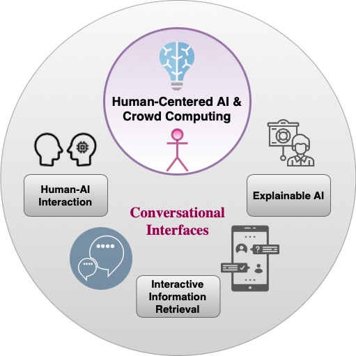

Ujwal Gadiraju is an Assistant Professor at the [Web Information Systems](http://wis.ewi.tudelft.nl/) group of the Faculty of Electrical Engineering, Mathematics and Computer Science (EEMCS/EWI), [*Delft University of Technology*](https://www.tudelft.nl/en/). He is a Director of the [Delft AI "Design@Scale" Lab](https://www.tudelft.nl/en/ai/design-at-scale-lab), and a member of the program management team of the [TU Delft AI Labs](https://www.tudelft.nl/en/ai/tu-delft-ai-labs). In addition, Ujwal co-leads the <a href="kappa">Kappa</a> research line on Crowd Computing and Human-Centered AI at the WIS group. He is a Distinguished Speaker of the ACM, and a board member of [*CHI Netherlands*](https://chinederland.nl). Ujwal is currently serving as the Co-Editor for two Frontiers in AI journals: (1) [Human-Centered AI and Crowd Computing](https://www.frontiersin.org/research-topics/19868/human-centered-ai-crowd-computing) and (2) [User Modeling and Recommendations](https://www.frontiersin.org/research-topics/19653/user-modeling-and-recommendations). He is also an Associate Editor of the Taylor and Francis [Behavior and Information Technology](https://www.tandfonline.com/toc/tbit20/current) journal and the Co-Editor-in-Chief of the [Human Computation Journal](http://hcjournal.org/). <!--was a Research Fellow at the [Weizenbaum Institute](https://www.weizenbaum-institut.de/en/) -->

----

Prior to joining the WIS group, Ujwal worked at the [L3S Research Center](https://www.l3s.de/en) as a Postdoctoral researcher between 2017-2020. Ujwal received a [PhD degree](http://www.l3s.de/en/node/1537) (Dr. rer. nat.) in Computer Science from the Leibniz University of Hannover, Germany in 2017, and an MSc. Computer Science degree from TU Delft, the Netherlands in 2012. His research interests lie at the intersection of Human-Computer Interaction (HCI), Artificial Intelligence (AI), and Information Retrieval (IR), with a special focus on Crowd Computing. Ujwal’s prior work in Crowd Computing has explored methods to improve the effectiveness of the crowdsourcing paradigm, running large-scale human-centered experiments to understand the interaction between humans and machines, and understanding the societal impact of algorithmic decision-making.

<!--Ujwal’s work focuses on systematically leveraging the ‘hybrid intelligence’ obtained by combining humans and machines to solve a range of problems in HCI and AI. -->

Ujwal's goal is to **create novel methods, interfaces, systems, and tools to overcome existing challenges on our path towards building better AI systems and facilitating better reliance of humans on AI systems**. 

<!-- To this end, his current research agenda includes the following topics:

 - <a href="adms">Human-AI Interaction, Human-AI Collaboration, and Human Computation</a>
 - <a href="conversational_interfaces">Conversational Agents and Interfaces</a>
 - <a href="kg">Human Factors in Interactive Information Retrieval</a> 

-->
 
----
<!--
# Current & Previous Students

 - <a href="https://richardhgl.github.io">Gaole He</a>
 - <a href="https://sihang.nl">Sihang Qiu</a>
 - <a href="https://scholar.google.com/citations?user=z0qzFVUAAAAJ">Tahir Abbas</a>
 
---
-->

# News

- \[27.08.2022\] 4 full papers accepted at the AAAI Human Computation and Crowdsourcing Conference [AAAI HCOMP 2022](https://www.humancomputation.com/)!
- \[29.04.2022\] &#127942; **Best Paper Award Nomination**  &#127942; at ACM Web Conference 2022 [ACM WWW 2022](https://www2022.thewebconf.org) for our work titled *"Ready Player One! Eliciting Diverse Knowledge Using A Configurable Game."*
- \[10.02.2022\] 2 full papers accepted at the [ACM CHI 2022](http://chi2022.acm.org/)!
- \[15.01.2022\] 3 full papers accepted at the ACM Web Conference 2022 [ACM WWW 2022](https://www2022.thewebconf.org)!
- \[1.12.2021\] I will serve as the *Publicity Chair* for [ACM HT 2022](https://ht.acm.org/ht2022/). Keep an eye out for some exciting new ideas that will take shape at HT2022!
- \[15.11.2021\] Amazon Science  &#127942; **Best Paper Award**  &#127942; at [AAAI HCOMP 2021](https://ujwalgadiraju.com/Publications/HCOMP2021b.pdf) for our work titled *"A Checklist to Combat Cognitive Biases in Crowdsourcing"*. 
- \[15.11.2021\] Toloka  &#127942; **Best Poster/Demo Award**  &#127942; at [AAAI HCOMP 2021](https://ujwalgadiraju.com/Publications/HCOMP2021e.pdf) for our work titled *"FindItOut: A Multiplayer GWAP for Collecting Plural Knowledge"*. 
- \[07.09.2021\] An article on a successful group project within our Crowd Computing course – [Intepreting Image Classification Models Via Crowdsourcing](https://www.datasciencecentral.com/profiles/blogs/interpreting-image-classification-models-via-crowdsourcing). 
- \[21.08.2021\] 3 full papers accepted to AAAI HCOMP 2021! 
- \[09.07.2021\] Full paper titled *"What Is Unclear? Computational Assessment of Task Clarity in Crowdsourcing"* has been accepted at [ACM HT 2021](https://ht.acm.org/ht2021/)! 
- \[23.06.2021\] Received the &#127942; **Best Reviewer Award** &#127942; at [ACM UMAP 2021](https://www.um.org/umap2021/index.php). 13 among more than 100 reviewers at UMAP 2021 were bestowed with this award.
- \[13.04.2021\] Full paper titled *"Improving Reactions to Rejection in Crowdsourcing Through Self-Reflection"* has been accepted at [ACM Web Science 2021](http://websci21.webscience.org/)! This began as a group project among students following the previous edition of the MSc. course on [Crowd Computing](https://studiegids.tudelft.nl/a101_displayCourse.do?course_id=55281).
 - \[08.03.2021\] 1 full paper exploring *Trust Development in Human-AI Interaction*, and 1 short paper exploring *User Biases in Web Search* accepted at [ACM UMAP 2021](https://www.um.org/umap2021/index.php)! 
 - \[30.01.2021\] Our proposal for a Delft AI Lab called 'Design@Scale' has been accepted. I will serve as a Director of the [Design@Scale Lab](https://www.tudelft.nl/en/ai/dats-lab), which focuses on Human-AI collaboration to design solutions for complex social problems. This lab is the product of a collaboration with wonderful colleagues from the Industrial Design Engineering faculty at TU Delft.
 - \[22.01.2021\] Appointed as an **ACM Distinguished Speaker**. This is a great way to engage with emerging professionals, students and the public on a range of topics in Crowd Computing and Human-Centered AI! 
 - \[08.12.2020\] Awarded a 5,000 EUR seed funding grant from the TU Delft Safety and Security Institute to support the ground work in building **Conversational Agents for Mental Health & Wellbeing**. The team consists of assistant professors [Dr. Trivik Verma](https://research.trivikverma.com/) from the TPM faculty and Dr. Derek Lomas from the IDE faculty. More on this coming up soon!
 - \[06.11.2020\] We have announced the first edition of **[The Academic Fringe Festival](https://www.academicfringe.org)** on *Crowd Computing and Human-Centered AI*.
 - \[27.10.2020\] Paper titled "Impact of Algorithmic Decision Making on Human Behavior: Evidence from Ultimatum Bargaining" with Alexander Erlei, Franck Awounang Nekdem, Lukas Meub, Avishek Anand received the &#127942; *Best Student Paper Award* &#127942; at <b> AAAI [HCOMP 2020](https://www.humancomputation.com/). </b> 
 - \[11.10.2020\] Paper titled "CrowdCO-OP: Sharing Risks and Rewards in Crowdsourcing" with Shaoyang Fan, Alessandro Checco, Gianluca Demartini received an &#127942; *Best Paper Honorable Mention Award* &#127942; at <b> ACM [CSCW 2020](https://cscw.acm.org/2020/). </b> 
 - \[31.07.2020\] Two full papers accepted at AAAI [HCOMP 2020](https://www.humancomputation.com/). 
 (1). "Trainbot: A Conversational Interface to Train Crowd Workers for Delivering On-Demand Therapy" with Tahir Abbas, Vassilis-Javed Khan, Panos Markopoulos. 
 (2). "Impact of Algorithmic Decision Making on Human Behavior: Evidence from Ultimatum Bargaining" with Alexander Erlei, Franck Awounang Nekdem, Lukas Meub, Avishek Anand.
 - \[25.07.2020\] Paper titled "CrowdCO-OP: Sharing Risks and Rewards in Crowdsourcing" with Shaoyang Fan, Alessandro Checco, Gianluca Demartini has been accepted to ACM [CSCW 2020](https://cscw.acm.org/2020/).
 - \[30.06.2020\] Paper titled "Towards Memorable Information Retrieval" with Sihang Qiu and Alessandro Bozzon was accepted to [ACM ICTIR 2020](https://ictir2020.org)!
 - \[08.06.2020\] Our HRI'20 [late breaking report](https://dl.acm.org/doi/abs/10.1145/3371382.3378332) received an &#127942; *Honorable Mention Award* &#127942;!
 - \[29.05.2020\] Paper titled "How Does Team Composition Affect Knowledge Gain of Users in Collaborative Web Search?" with Luyan Xu and Xuan Zhou was accepted to [ACM HT2020](https://ht.acm.org/ht2020/)!
 - \[20.04.2020\] Course on Crowd Computing ([CS4145](https://studiegids.tudelft.nl/a101_displayCourse.do?course_id=51132)) with [Alessandro](https://www.alessandrobozzon.com) and [Nava](http://www.navatintarev.com) begins!
 - \[09.04.2020\] Paper titled "Estimating Conversational Styles in Conversational Microtask Crowdsourcing" with Sihang Qiu and Alessandro Bozzon has been accepted to ACM [CSCW 2020](https://cscw.acm.org/2020/).
 - \[01.04.2020\] Ujwal joined the [WIS group](http://wis.ewi.tudelft.nl/) at TU Delft as an Assitant Professor.
 - \[01.01.2020\] Ujwal is serving as the Program Chair for the [ACM Conference on Hypertext and Social Media](https://ht.acm.org/ht2020/) (HT 2020), the Publicity Co-chair for the [ACM International Conference on Information and Knowledge Management](https://cikm2020.org) (CIKM 2020) and the Sponsorship Co-chair for the [AAAI Conference on Human Computation and Crowdsourcing](https://www.humancomputation.com) (HCOMP 2020).

 
