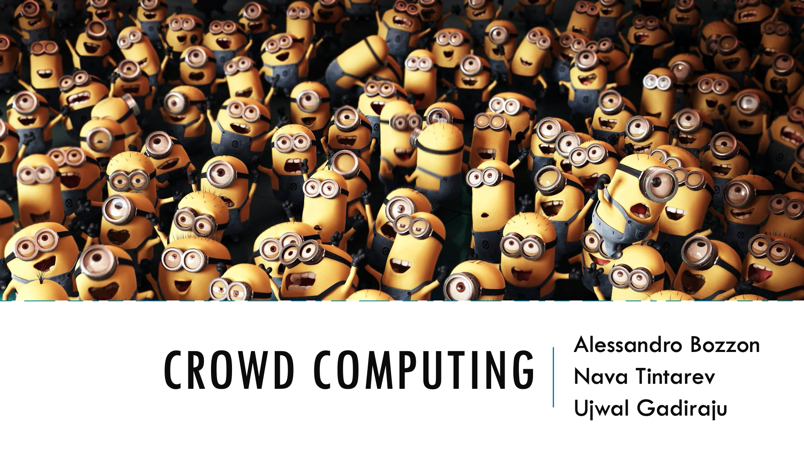
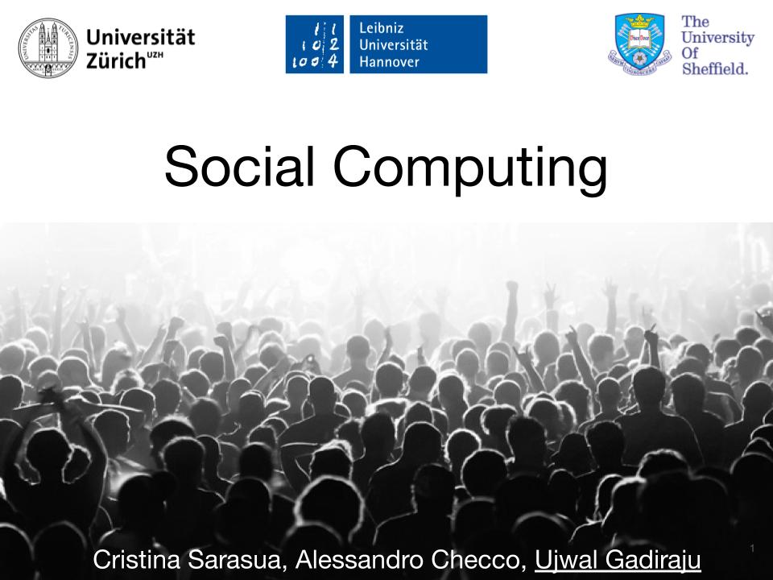

# Teaching Activities

## 2020

- **Applied Machine Learning (CS4305TU)** with colleagues, Delft University of Technology

Machine Learning is increasingly important to fields outside of traditional Artificial Intelligence and Computer Science, proving a powerful technique to study data from different domains. This course aims to give students from different technical backgrounds a better understanding of a range of machine learning techniques. During the course, the focus lies on understanding how to use these different techniques, rather than on trying to improve the techniques themselves. To do this, this course will focus on demonstrating how machine learning can be used in different domains and for different types of data. Throughout the course, teachers from different faculties will apply the techniques they teach to their own domain of research to give students experience with a wide range of topics studied at TUDelft. Additionally, the course will address some of the ethical and societal issues around machine learning such as privacy and bias.

- **Crowd Computing (CS4145)** with Alessandro Bozzon and Nava Tintarev, Delft University of Technology

Crowd Computing is an emerging field that sits at the intersection of computer science and data science. Crowd computing studies how large groups of people can solve complex tasks that are currently beyond the capabilities of artificial intelligence algorithms, and that cannot be solved by a single person alone. 
It involves algorithmic engagement and coordination of people by means of Web-enabled platforms. These complex tasks are mainly focused on the creation, enrichment, and interpretation of data, making crowd computing a building block of data science. Examples of such tasks include the coordinated creation of data about real world events when electronic sensors are not available; the annotation of existing data sets to create ground truth data for the training of machine learning algorithms; and the analysis and interpretation of Web data to spot identify inappropriate content (e.g.,hate speech, or fake news).

## 2019

- **Foundations of Human Computation and Crowdsourcing** with Sergej Zerr, Leibniz University of Hannover

- **Social Computing** with Alessandro Checco and Cristina Sarasua, University of Zurich  

## 2018

- **Foundations of Human Computation and Crowdsourcing** with Sergej Zerr, Leibniz University of Hannover

- **Social Computing** with Alessandro Checco and Cristina Sarasua, University of Zurich

- **[Seminar on Foundations of Human Computation](https://www2.kbs.uni-hannover.de/hcomp-seminar.html)** with Sergej Zerr, Leibniz University of Hannover

