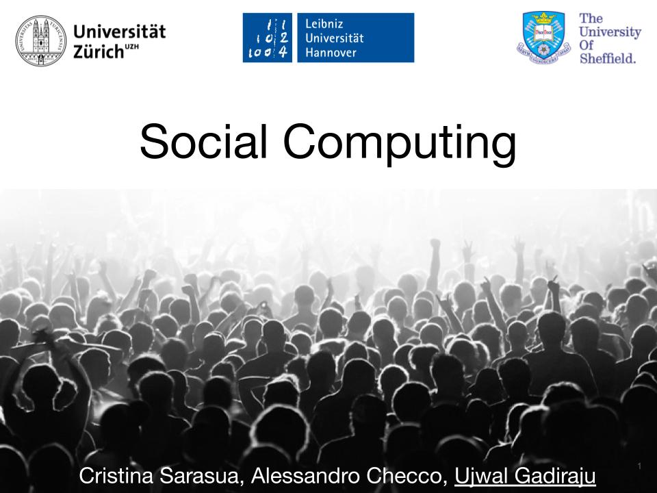

# Teaching Activities

## 2020

- **Crowd Computing (CS4145)** with Alessandro Bozzon and Nava Tintarev, Delft University of Technology

## 2019

- **Foundations of Human Computation and Crowdsourcing** with Sergej Zerr, Leibniz University of Hannover

- **Social Computing** with Alessandro Checco and Cristina Sarasua, University of Zurich  

## 2018

- **Foundations of Human Computation and Crowdsourcing** with Sergej Zerr, Leibniz University of Hannover

- **Social Computing** with Alessandro Checco and Cristina Sarasua, University of Zurich

- **[Seminar on Foundations of Human Computation](https://www2.kbs.uni-hannover.de/hcomp-seminar.html)** with Sergej Zerr, Leibniz University of Hannover

